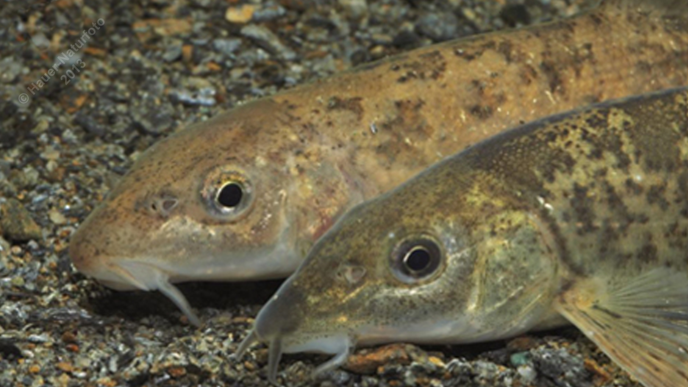

# Semling (Hundsbarbe)

**Lateinischer Name:** *Barbus balcanicus*

## Allgemeine Informationen

### Schonzeit
**Ganzjährig geschont!**

### Brittelmaß
Keines (da ganzjährig geschont)

## Merkmale und Aussehen

### Wesentliche Merkmale
- Zwei Barteln am Oberlippenrand, zwei in den Maulwinkeln (vier insgesamt)
- Unterständiges Maul mit fleischigen Lippen
- **Auffällig lange Afterflosse** (Ende reicht bis zum Schwanzflossenansatz)

### Größe
20-25 cm

## Lebensweise

### Lebensräume
Donau

### Nahrung
- Bodenorganismen
- Wirbellose Kleintiere
- Selten pflanzliche Stoffe

## Besonderheiten
Der Semling ist eine geschützte Donaufischart, die der Barbe ähnelt. Das charakteristische Merkmal ist die sehr lange Afterflosse, die bis zum Ansatz der Schwanzflosse reicht. Er ist kleiner als die gewöhnliche Barbe.
