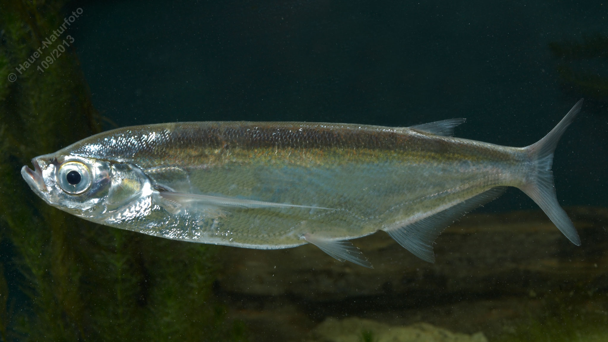

# Sichling (Ziege)

**Lateinischer Name:** *Pelecus cultratus*

## Allgemeine Informationen

### Schonzeit
**Ganzjährig geschont!**

### Brittelmaß
Keines (da ganzjährig geschont)

## Merkmale und Aussehen

### Wesentliche Merkmale
- Schlanker niedriger Körper mit fast gerader Rückenlinie und **kielförmiger Bauchkante**
- Stark oberständiges Maul
- Große Brustflossen
- Rückenflosse beginnt über der Afterflosse
- Wellenförmige Seitenlinie

### Größe
Durchschnittlich 30 cm, maximal bis 45 cm

## Lebensweise

### Lebensräume
Langsam fließende Donauabschnitte, seichte Seen der Tiefebene.

### Nahrung
Wirbellose Kleintiere:
- Plankton
- Insektenlarven
- Anflugnahrung (Insekten von der Oberfläche)

## Besonderheiten
Der Sichling hat einen sehr ungewöhnlichen, stark seitlich abgeflachten Körper mit scharfer, kielförmiger Bauchkante (daher auch "Ziege" genannt). Er ist ein Oberflächenfisch und durch seine außergewöhnliche Körperform unverwechselbar. Die großen Brustflossen ermöglichen ihm schnelle Wendemanöver.
