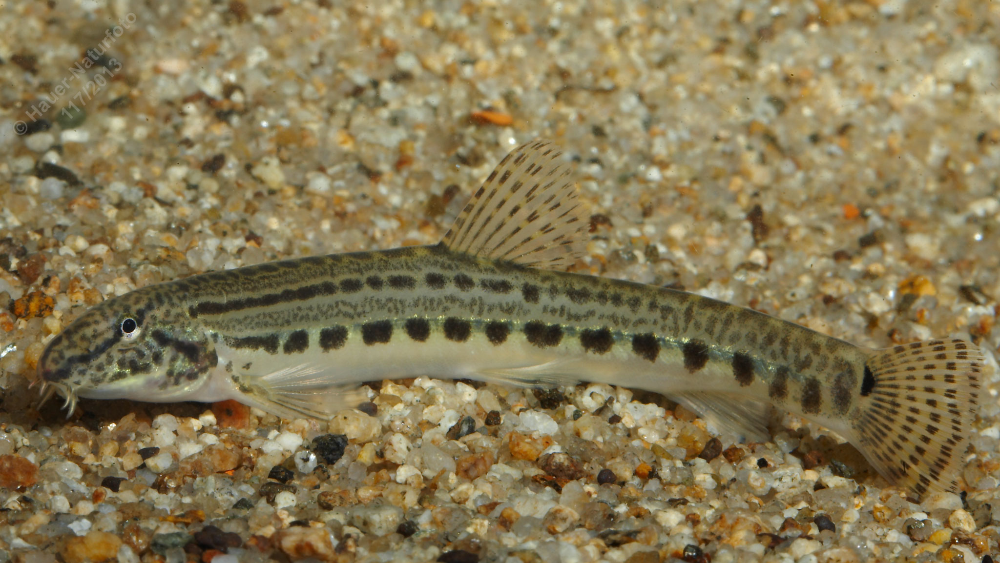

# Steinbeißer (Dorngrundel, Steinpeitzger)

**Lateinischer Name:** *Cobitis elongatoides*

## Allgemeine Informationen

### Schonzeit
**Ganzjährig geschont!**

### Brittelmaß
Keines (da ganzjährig geschont)

## Merkmale und Aussehen

### Wesentliche Merkmale
- Vier Barteln an der Oberlippe, zwei in den Maulwinkeln
- Schlanker langgestreckter Körper
- Zweispitzige Stacheln unter dem Auge
- **Ein** dunkler Fleck am Schwanzflossenansatz (im Gegensatz zum Goldsteinbeißer!)

### Größe
8-10 cm

## Lebensweise

### Lebensräume
Bodenbewohner fließender und stehender Gewässer mit sandigem Grund. Gräbt sich tagsüber bis zum Kopf in den Sand ein.

### Nahrung
- Bodenorganismen
- Pflanzliche Stoffe

## Besonderheiten
Der Steinbeißer gräbt sich tagsüber in den sandigen Gewässerboden ein, sodass nur noch der Kopf herausschaut. Bei Bedrohung kann er die zweispitzigen Stacheln unter dem Auge aufstellen. Er ist nachtaktiv und eine geschützte Art.

## Nicht verwechseln!
**Steinbeißer:** Ein dunkler Fleck am Schwanzflossenansatz  
**Goldsteinbeißer:** Zwei dunkle Flecken am Schwanzflossenansatz
