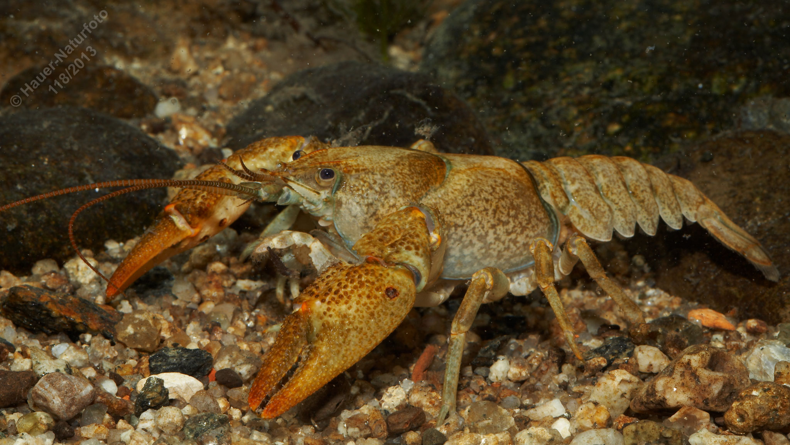

# Steinkrebs (Bachkrebs)

**Lateinischer Name:** *Austropotamobius torrentium*

## Allgemeine Informationen

### Schonzeit
**Ganzjährig geschont!**

### Brittelmaß
Keines (da ganzjährig geschont)

## Merkmale und Aussehen

### Wesentliche Merkmale
- Grau bis grünlichbraun
- Scheren relativ groß, aber Unterseite **blassgelb bis weiß** (im Gegensatz zum Edelkrebs!)
- Einteilige Hinteraugenleiste (ein Paar Postorbitalknoten)
- Keine Dornen oder Höcker am Carapax (Rückenpanzer)

### Größe
10-12 cm Körperlänge  
Weibchen sind kleiner als Männchen

## Lebensweise

### Lebensräume
Quellregionen und Oberläufe kühlerer Gewässer mit steinigem Grund. Benötigt eine Sommertemperatur von mindestens 10°C. Sehr empfindlich gegenüber Gewässerverunreinigungen.

### Nahrung
**Allesfresser:**
- Tierische Nahrung
- Wasserpflanzen
- Algen

## Besonderheiten
Der Steinkrebs ist deutlich kleiner als der Edelkrebs und bewohnt kühle Quellbäche und Oberläufe. Seine Bestände sind stark zurückgegangen durch Gewässerverschmutzung, Verbauungen und die Einschleppung des Signalkrebses (der die tödliche Krebspest überträgt). Die blassgelbe bis weiße Scherenunterseite unterscheidet ihn vom Edelkrebs. Er ist ganzjährig geschont!

## Nicht verwechseln!
**Steinkrebs:** Blassgelbe bis weiße Scherenunterseite, kleiner, kühlere Gewässer  
**Edelkrebs:** Rötliche Scherenunterseite, rotes Scherengelenk, größer, wärmere Gewässer
