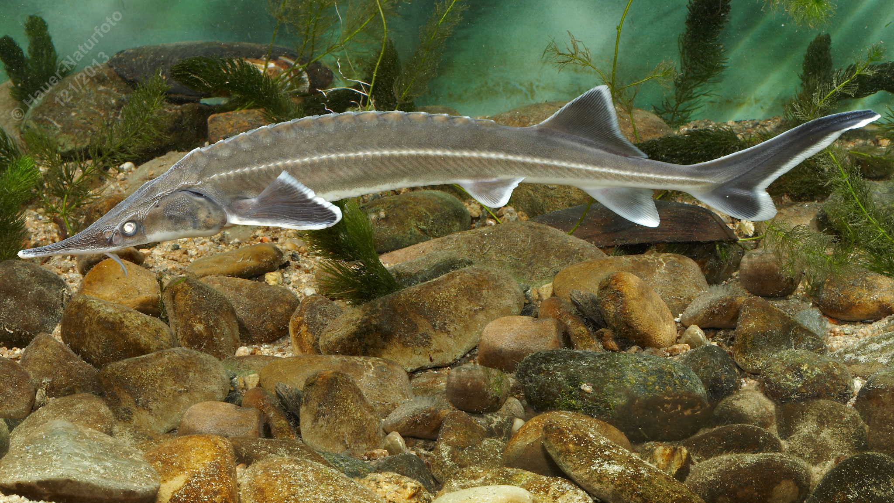

# Sterlet

**Lateinischer Name:** *Acipenser ruthenus*

## Allgemeine Informationen

### Schonzeit
**Ganzjährig geschont!**

### Brittelmaß
Keines (da ganzjährig geschont)

## Merkmale und Aussehen

### Wesentliche Merkmale
- Spitze langgestreckte Schnauze
- Kleine weiße Seitenschilder
- Weiße Flossensäume
- Vorstülpbares Maul mit vier Bartfäden mit kurzen Fransen
- Ganoidschuppen (Knochenschuppen typisch für Störe)

### Größe
Durchschnittlich 40-60 cm, maximal über 100 cm und bis 20 kg

## Lebensweise

### Lebensräume
Donau. Der Sterlet ist ein **reiner Süßwasserbewohner** (im Gegensatz zu anderen Stören).

### Nahrung
Wirbellose Bodenorganismen:
- Insektenlarven
- Würmer
- Schnecken
- Kleinkrebse

### Fortpflanzung
Wandert zum Laichen flussaufwärts. Laicht im Frühjahr über Kiesgrund in der Strömung.

## Besonderheiten
Der Sterlet ist der kleinste europäische Stör und als einziger Stör ein reiner Süßwasserbewohner (wandert nicht ins Meer). Die charakteristischen weißen Seitenschilder und Flossensäume machen ihn gut erkennbar. Er ist stark gefährdet und ganzjährig geschont. Störe gehören zu den ältesten Knochenfischgruppen und haben sich seit Millionen Jahren kaum verändert.
