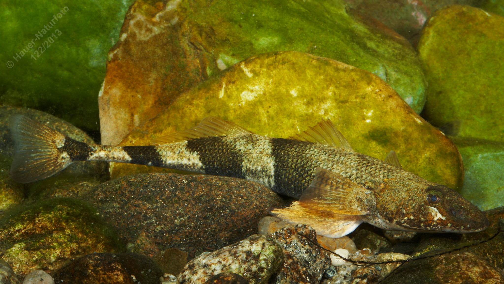

# Streber

**Lateinischer Name:** *Zingel streber*

## Allgemeine Informationen

### Schonzeit
**Ganzjährig geschont!**

### Brittelmaß
Keines (da ganzjährig geschont)

## Merkmale und Aussehen

### Wesentliche Merkmale
- Zwei getrennte Rückenflossen
- Vordere Rückenflosse hat 8-9 Stachelstrahlen
- Unterständiges Maul
- Kräftiger Dorn am Kiemendeckel
- 4-5 dunkle Querbinden mit **scharf abgegrenzten Rändern**
- Auffallend dünner Schwanzstiel

### Größe
Durchschnittlich 12-15 cm, selten über 18 cm

## Lebensweise

### Lebensräume
Donau und einige Zuflüsse.

### Nahrung
Kleintiere der Bodenfauna

## Besonderheiten
Der Streber ist ein kleiner Bodenfisch aus der Familie der Echten Barsche und lebt ausschließlich in der Donau und einigen Zuflüssen. Er ist eng verwandt mit dem Zingel, aber kleiner. Die scharf abgegrenzten Querbinden und der sehr dünne Schwanzstiel sind charakteristisch. Er ist eine stark gefährdete und geschützte Art.

## Nicht verwechseln!
**Streber:** 8-9 Stachelstrahlen in vorderer Rückenflosse, 4-5 Querbinden mit scharfen Rändern, kleiner  
**Zingel:** 13-15 Stachelstrahlen, Querbinden mit verwaschenen Rändern, größer
