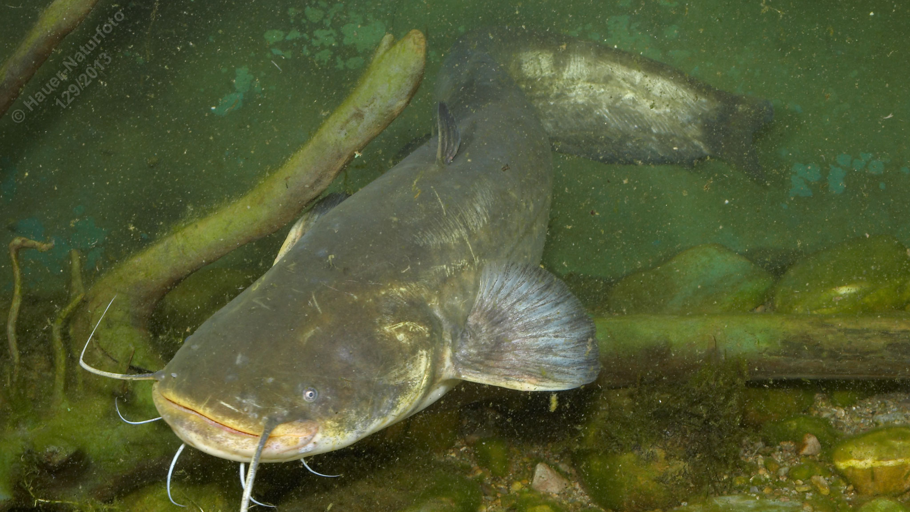

# Wels (Waller)

**Lateinischer Name:** *Silurus glanis*

## Allgemeine Informationen

### Schonzeit
1. Juni bis 30. Juni

### Brittelmaß
80 cm

## Merkmale und Aussehen

### Wesentliche Merkmale
- Breiter flacher Kopf mit großem endständigem Maul
- **Sechs Barteln** (zwei lange an Oberlippe, vier kürzere an Unterlippe)
- Kleine Augen
- Lange bis zur Schwanzflosse reichende Afterflosse
- Kleine weit vorne sitzende Rückenflosse
- **Keine Schuppen**

### Größe
Durchschnittlich 100-150 cm, maximal bis 300 cm und 300 kg

### Alter
Bis 80 Jahre

## Lebensweise

### Lebensräume
Größere Flüsse oder Seen mit ruhigen Stellen und schlammigem oder sandigem Grund.

### Nahrung
- Hauptsächlich Fische
- Aber auch Amphibien, Wasservögel, kleine Säugetiere

### Verhalten
- Dämmerungs- und nachtaktiver Bodenfisch
- Betreibt Brutpflege

## Besonderheiten
Der Wels ist der größte reine Süßwasserfisch Europas und kann über 2 Meter lang und mehrere hundert Kilogramm schwer werden. Er ist ein ausgesprochener Nachtjäger, der mit seinen Barteln und seinem ausgezeichneten Gehör auch im Dunkeln Beute findet. Die Männchen bewachen das Laichgelege bis zum Schlüpfen der Jungfische. Der Wels hat keine Schuppen, sondern eine glatte, schleimige Haut.
