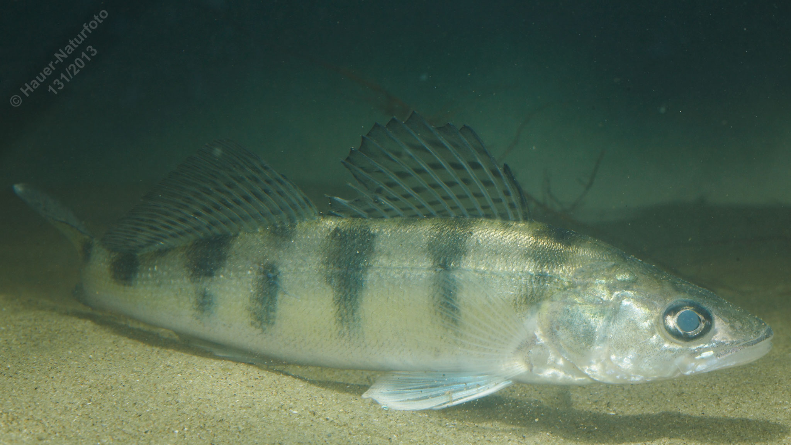

# Wolgazander

**Lateinischer Name:** *Sander volgensis*

## Allgemeine Informationen

### Schonzeit
1. März bis 30. April

### Brittelmaß
35 cm

## Merkmale und Aussehen

### Wesentliche Merkmale
- Zwei getrennte Rückenflossen (erstere höher als beim Zander)
- Brustständige Bauchflossen
- Endständiges Maul
- **Keine Hundszähne** (im Gegensatz zum Zander!)
- Spitzen der Schwanzflosse weiß gefärbt

### Größe
Durchschnittlich 30-40 cm, maximal 50 cm

## Lebensweise

### Lebensräume
Wärmere, nährstoff- und planktonreiche Gewässer mit sandigem Grund (Donau).

### Nahrung
- Wassertiere
- Kleine Fische

### Fortpflanzung
Ähnlich dem Zander: Eier werden in Bändern an Pflanzen, Steinen und Astwerk abgelegt. Bewachung durch das Männchen.

## Besonderheiten
Der Wolgazander ist dem Zander sehr ähnlich, aber kleiner. Ein wichtiges Unterscheidungsmerkmal ist das Fehlen der großen Hundszähne und die weiß gefärbten Spitzen der Schwanzflosse. Er kommt in der Donau vor und ist weniger häufig als der Zander.

## Nicht verwechseln!
**Wolgazander:** Keine Hundszähne, weiße Spitzen an der Schwanzflosse, erste Rückenflosse höher  
**Zander:** Zwei Paar große Hundszähne, keine weißen Spitzen an der Schwanzflosse
