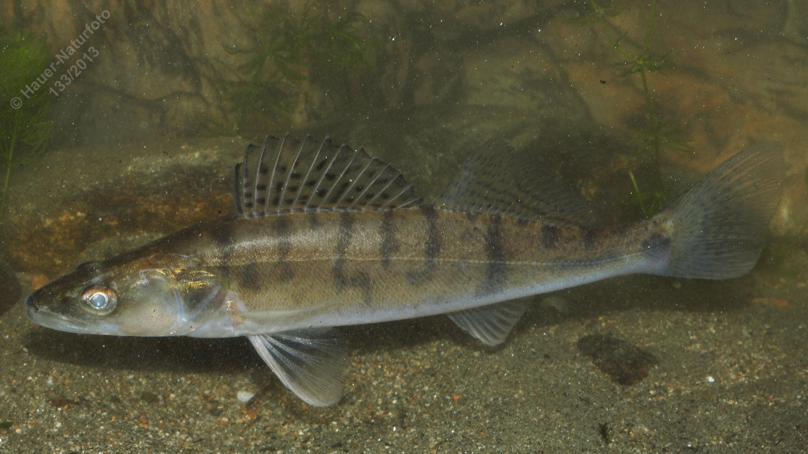

# Zander (Schill)

**Lateinischer Name:** *Sander lucioperca*

## Allgemeine Informationen

### Schonzeit
1. März bis 30. April

### Brittelmaß
50 cm

## Merkmale und Aussehen

### Wesentliche Merkmale
- Zwei Rückenflossen (vordere mit Stachelstrahlen)
- Spitze Schnauze mit endständigem Maul
- Viele kleine Zähne und **zwei Paar größere Hundszähne**

### Größe
Durchschnittlich 40-60 cm, maximal bis 110 cm und über 15 kg

### Alter
Bis 15 Jahre

## Lebensweise

### Lebensräume
Wärmere, nährstoff- und planktonreiche Gewässer mit hartem sandigem Grund.

### Nahrung
- Kleine Wassertiere
- Fische

### Verhalten
- Meist nahe dem Gewässergrund
- Eier werden an Pflanzen, Steinen und Astwerk abgelegt
- Bewachung durch das Männchen (Brutpflege)

## Besonderheiten
Der Zander ist ein beliebter Speisefisch und wichtiger Raubfisch in wärmeren Gewässern. Im Gegensatz zum Hecht jagt er auch in der Dämmerung und bei Nacht. Seine großen Augen sind an das Sehen bei wenig Licht angepasst. Die charakteristischen "Hundszähne" (zwei Paare größerer Fangzähne) machen ihn unverwechselbar. Die Männchen betreiben intensive Brutpflege und bewachen das Gelege.
