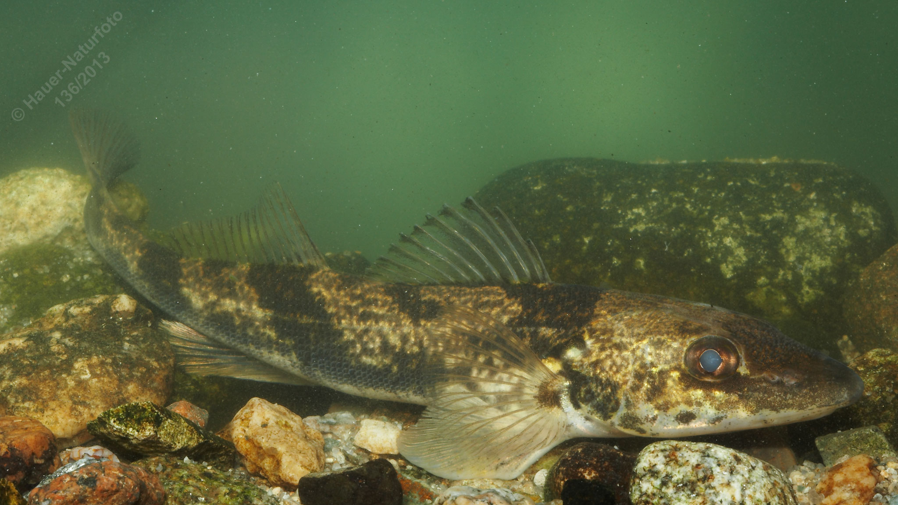

# Zingel

**Lateinischer Name:** *Zingel zingel*

## Allgemeine Informationen

### Schonzeit
1. März bis 30. April

### Brittelmaß
20 cm

## Merkmale und Aussehen

### Wesentliche Merkmale
- Vordere Rückenflosse hat **13-15 Stachelstrahlen**
- Dunkle Querbinden mit **verwaschenen Rändern**
- Kräftiger Dorn am Kiemendeckel
- Brustständige Bauchflossen
- Unterständiges Maul

### Größe
Durchschnittlich 15-30 cm, maximal über 40 cm und 1 kg

## Lebensweise

### Lebensräume
Donau und einige Zuflüsse.

### Nahrung
- Bodenorganismen und Kleintiere (Insektenlarven, Würmer, Kleinkrebse)
- Auch kleine Fische

## Besonderheiten
Der Zingel ist ein typischer Bodenfisch der Donau und gehört zur Familie der Echten Barsche. Er ist größer als der verwandte Streber und hat deutlich mehr Stachelstrahlen (13-15 statt 8-9). Die Querbinden haben verwaschene (unscharfe) Ränder, was ihn vom Streber unterscheidet.

## Nicht verwechseln!
**Zingel:** 13-15 Stachelstrahlen, Querbinden mit verwaschenen Rändern, größer  
**Streber:** 8-9 Stachelstrahlen, 4-5 Querbinden mit scharfen Rändern, kleiner
