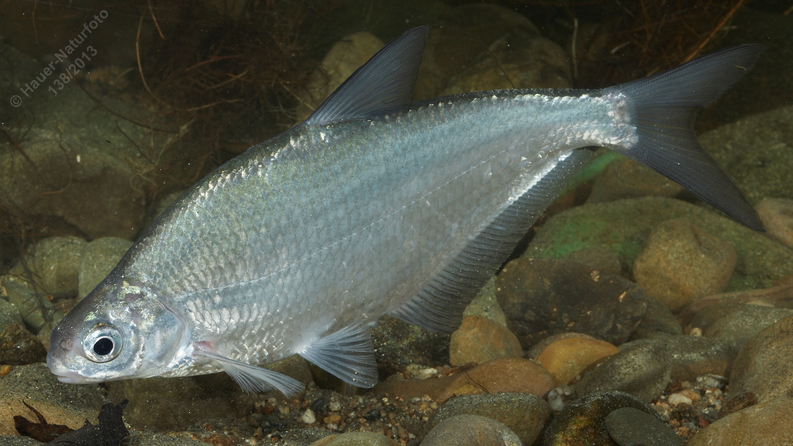

# Zobel (Scheibpleinzen, Dornbrachsen)

**Lateinischer Name:** *Ballerus sapa*

## Allgemeine Informationen

### Schonzeit
**Ganzjährig geschont!**

### Brittelmaß
Keines (da ganzjährig geschont)

## Merkmale und Aussehen

### Wesentliche Merkmale
- Hochrückig, stark abgeflacht, perlmuttartig glänzend
- Hochgewölbte stumpfe Schnauze
- Leicht unterständiges Maul
- Unterer Lappen der Schwanzflosse länger
- Sehr lange Afterflosse
- Augen relativ groß

### Größe
Durchschnittlich 20-30 cm, selten bis 50 cm

## Lebensweise

### Lebensräume
Gesellig in Bodennähe in Donau und größeren Zuflüssen.

### Nahrung
- Wirbellose Kleintiere
- Pflanzliche Stoffe

## Besonderheiten
Der Zobel ist ein hochrückiger, stark abgeflachter Fisch mit perlmuttartigem Glanz. Der untere Lappen der Schwanzflosse ist länger als der obere, und die Afterflosse ist sehr lang. Er lebt gesellig in Bodennähe und ist eine geschützte Donaufischart.
