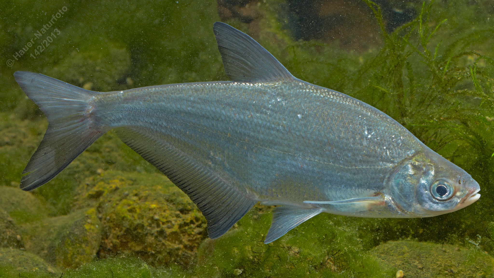

# Zope (Pleinzen)

**Lateinischer Name:** *Ballerus ballerus*

## Allgemeine Informationen

### Schonzeit
**Ganzjährig geschont!**

### Brittelmaß
Keines (da ganzjährig geschont)

## Merkmale und Aussehen

### Wesentliche Merkmale
- Leicht oberständiges Maul
- Kleine Schuppen
- Unterer Lappen der Schwanzflosse länger
- Paarige Flossen blaßgelb bis bräunlich mit dunklem Rand

### Größe
Durchschnittlich 25 cm, selten bis 45 cm und über 500 g

## Lebensweise

### Lebensräume
Gesellig im Freiwasser größerer Flüsse (Donau).

### Nahrung
- Wirbellose Kleintiere
- Pflanzliche Stoffe

## Besonderheiten
Die Zope ist eng verwandt mit dem Zobel, lebt aber im Freiwasser statt in Bodennähe. Sie hat ein leicht oberständiges Maul (der Zobel ein leicht unterständiges) und ist durch die kleinen Schuppen und den längeren unteren Schwanzflossenlappen gekennzeichnet. Sie ist eine geschützte Donaufischart.

## Nicht verwechseln!
**Zope:** Leicht oberständiges Maul, lebt im Freiwasser  
**Zobel:** Leicht unterständiges Maul, lebt in Bodennähe, perlmuttartig glänzend
