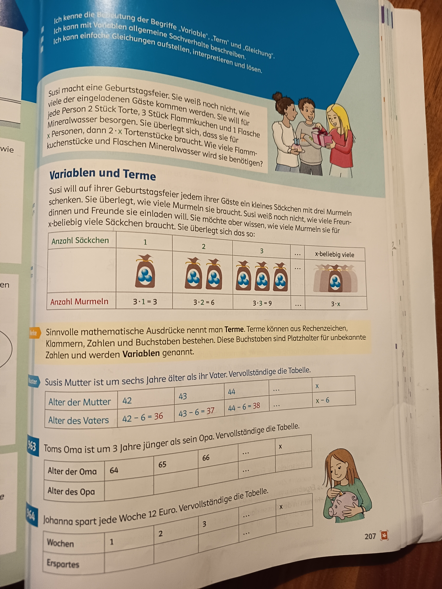

# Variablen und Terme

## Einführungsbeispiel: Susis Geburtstagsfeier

Susi macht eine Geburtstagsfeier. Sie weiß noch nicht, wie viele der eingeladenen Gäste kommen werden. Sie will für jede Person 1 Stück Torte, 3 Stück Flammkuchen und 1 Flasche Mineralwasser besorgen. Susi überlegt sich, dass sie für x Personen, dann $2 \times x$ Tortenstücke braucht. Wie viele Flammkuchenstücke und Flaschen Mineralwasser wird sie benötigen?

### Aufgabe: Murmeln verschenken

Susi will auf ihrer Geburtstagsfeier jedem ihrer Gäste ein kleines Säckchen mit drei Murmeln schenken. Sie überlegt, wie viele Murmeln sie braucht. Susi weiß noch nicht, wie viele Freundinnen und Freunde sie einladen will. Sie möchte aber wissen, wie viele Murmeln sie für x-beliebig viele Gäste braucht. Sie überlegt sich das so:

| Anzahl Säckchen | 1 | 2 | 3 | ... | x-beliebig viele |
|-----------------|---|---|---|-----|------------------|
| Anzahl Murmeln  | $3 \cdot 1 = 3$ | $3 \cdot 2 = 6$ | $3 \cdot 3 = 9$ | ... | $3 \cdot x$ |

Die Tabelle zeigt: Für jedes zusätzliche Säckchen werden genau 3 weitere Murmeln benötigt. Die Anzahl der Murmeln lässt sich durch den Ausdruck $3 \cdot x$ berechnen, wobei $x$ für eine beliebige Anzahl von Gästen steht.

## Was sind Terme?

**Definition:** Sinnvolle mathematische Ausdrücke nennt man **Terme**. Terme können aus Rechenzeichen, Klammern, Zahlen und Buchstaben bestehen. Diese Buchstaben sind Platzhalter für unbekannte Zahlen und werden **Variablen** genannt.

**Beispiele für Terme:**
- $3 \cdot x$
- $42 - 6$
- $x + 6$
- $44 - x + 38$

## Übungsaufgaben mit Variablen

### Aufgabe 41: Alter der Mutter

Susis Mutter ist um sechs Jahre älter als ihr Vater. Vervollständige die Tabelle.

| Alter der Mutter | 42 | 43 | 44 | ... | $x$ |
|------------------|----|----|----|----|-----|
| Alter des Vaters | $42 - 6 = 36$ | $43 - 6 = 37$ | $44 - 6 = 38$ | ... | $x - 6$ |

**Erklärung:** Wenn die Mutter $x$ Jahre alt ist, dann ist der Vater $x - 6$ Jahre alt.

### Aufgabe 42: Alter der Oma

Toms Oma ist um 3 Jahre jünger als sein Opa. Vervollständige die Tabelle.

| Alter der Oma | 64 | 65 | 66 | ... | $x$ |
|---------------|----|----|----|----|-----|
| Alter des Opa |    |    |    | ... |     |

**Hinweis:** Wenn die Oma jünger ist, ist der Opa älter. Der Term für das Alter des Opas ist $x + 3$.

### Aufgabe 43: Johannas Sparplan

Johanna spart jede Woche 12 Euro. Vervollständige die Tabelle.

| Wochen | 1 | 2 | 3 | ... | $x$ |
|--------|---|---|---|----|-----|
| Erspartes |  | | | ... |     |

**Hinweis:** Nach $x$ Wochen hat Johanna $12 \cdot x$ Euro gespart.

## Zusammenfassung

- **Variablen** sind Buchstaben, die als Platzhalter für beliebige Zahlen verwendet werden (meist $x$, $y$, $z$)
- **Terme** sind mathematische Ausdrücke mit Zahlen, Variablen und Rechenzeichen
- Mit Variablen können wir allgemeine Zusammenhänge beschreiben
- Tabellen helfen, Muster zu erkennen und Terme aufzustellen
